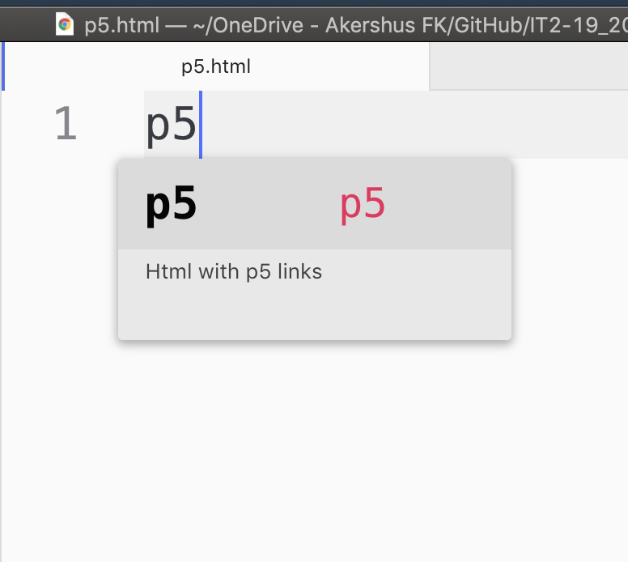

# p5js-snippets

Legge til p5-snippets i Atom

 - Velg «snippets» under "file"/"atom" i menybaren
 - Lim inn innholdet i denne [filen](./snippets.cson) nederst i .cson-filen
 - Lukk filen
 - Skriv p5 og trykk tab i html- og javascript-filer
